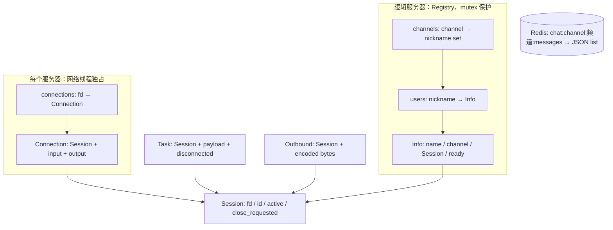
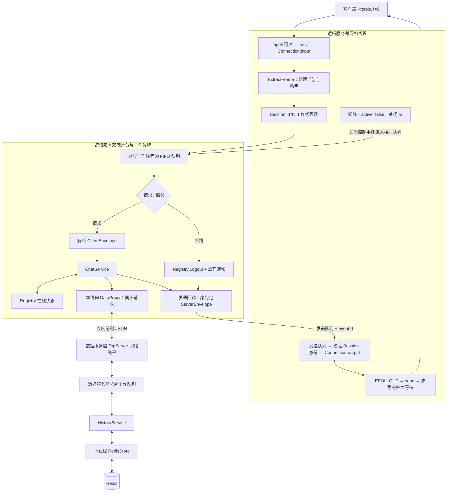
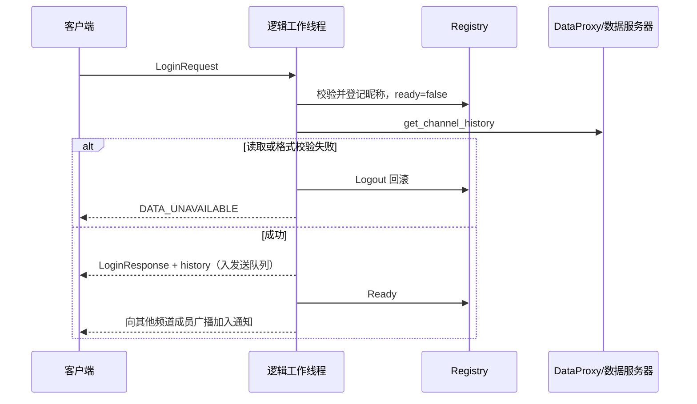

# 架构、数据结构和服务流程

## 1. 框架与业务的分界

判断标准是“它需要理解聊天规则吗”，不是“它有没有 socket 调用”。

| 模块 | 保存什么 | 负责什么 | 不负责什么 |
|---|---|---|---|
| TcpServer | 连接表、分片队列、发送队列 | accept、epoll、拆帧、工作调度、发送、关闭 | 用户、频道、消息历史 |
| socket_io | 临时帧数据 | 长度前缀、阻塞收发、连接超时 | Protobuf/JSON 业务字段 |
| Registry | 在线用户、频道成员 | 登录登记、就绪、查询、退出 | 建立 socket、访问 Redis |
| ChatService | 对 Registry 的引用、发送回调 | 登录、聊天、退出与广播 | epoll、字节缓冲区 |
| HistoryService | 无长期状态 | 校验数据请求并调用 RedisStore | 客户端在线状态 |
| DataProxy | 当前工作线程的数据服务器连接 | 组装 JSON、校验响应、报告失败 | 登录规则 |
| RedisStore | 当前工作线程的 Redis 连接 | RESP、历史列表、原子追加裁剪 | 频道成员广播 |

DataProxy 和 RedisStore 是存储适配层，含业务协议和存储策略，不属于纯通用网络框架。

## 2. 数据结构总图

`fd` 是操作系统资源编号，关闭后可能复用；`id` 是进程内递增连接编号，用于稳定分片。
网络线程应用发送任务时，同时比较 fd 和 Session 对象身份，避免旧响应发给复用该 fd 的新连接。
`active` 是线程间可见的连接有效标志，不代表 Connection 的字符串缓冲区可以被多线程随意修改。

`ready=false` 表示已占用昵称，但历史还未读取完成。只有登录响应入队并置为 ready 后，
该连接才进入频道广播接收者列表。InfoFor/Logout 和整个业务流程的顺序并非单靠 mutex 保证，
还依赖固定分片调度。

## 3. 完整线程与数据流

两个服务器分别拥有 1 个网络线程（运行于 main）和 N 个工作线程，默认 N=4。
客户端是输入主线程和接收线程；Redis 线程不属于本程序的线程。
没有额外的“推送线程”：业务产生广播后仍通过同一个发送队列和网络线程发出。

## 4. 为什么同一连接不会乱序

例如连续收到“登录 → 发送消息 → 退出”，三条任务以解析顺序进入同一 FIFO，
由同一个工作线程执行；不会出现发送任务抢先于登录完成的情况。

断线也是任务。如果网络线程在登录查询历史时发现断线，会先标记 active=false 并关闭 socket，
随后把清理任务放到同一队列。当前登录处理结束后，该线程才执行 Logout；关闭后的待处理请求被跳过。
因此不会出现网络线程先 Logout，工作线程随后又注册出一个永远无法清理的在线用户。

不同连接可能属于不同分片，Registry 仍需锁保护。分片并不提供跨连接的全局广播顺序。

## 5. 登录流程

图中的回复箭头表示交给网络发送链路，不是工作线程直接向客户端 send。

## 6. 发送与退出

发送：确认登录 → 校验 1–8192 字节内容 → 由服务器填写发送者、频道和时间 →
DataProxy.Append → HistoryService → RedisStore 的 Lua 追加/裁剪 →
向发送者确认 → 向频道所有 ready 成员（含发送者）广播。

主动退出：退出响应入队 → Registry.Logout → 向其他成员广播。
客户端等到退出响应或等待超时后关闭 socket；随后收到的断线事件再 Logout 不会产生第二次离开通知。

## 7. 资源上限与关闭

| 资源 | 当前上限/策略 |
|---|---|
| 单帧正文 | 1 MiB |
| 活动或清理中的 Session | 1024 |
| 每分片普通任务队列 | 128，满时关闭提交任务的连接 |
| 全局发送队列 | 256，满时请求关闭目标连接 |
| 每连接输出缓冲区 | 4 MiB，超限关闭慢接收端 |
| 每轮单连接读入 | 256 KiB，避免长期占用网络循环 |
| 关闭控制事件 | 不丢弃，数量受尚未清理的 Session 总数约束 |

收到 SIGINT/SIGTERM → 信号处理器只设置标志 → epoll 最迟约 100ms 后检查标志 →
关闭监听和客户端连接、为每个连接排入清理 → 停止队列并排空 → join 工作线程 →
最后关闭 eventfd 和 epoll。下游 socket 有等待超时，但这是分次等待的上限，
不构成对任意缓慢下游的绝对退出时限保证。
