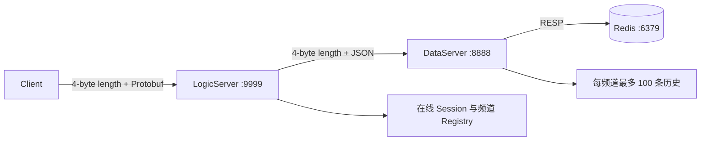
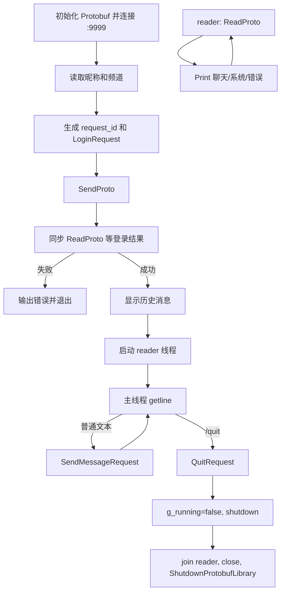
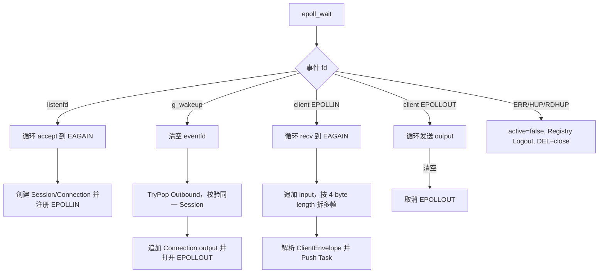
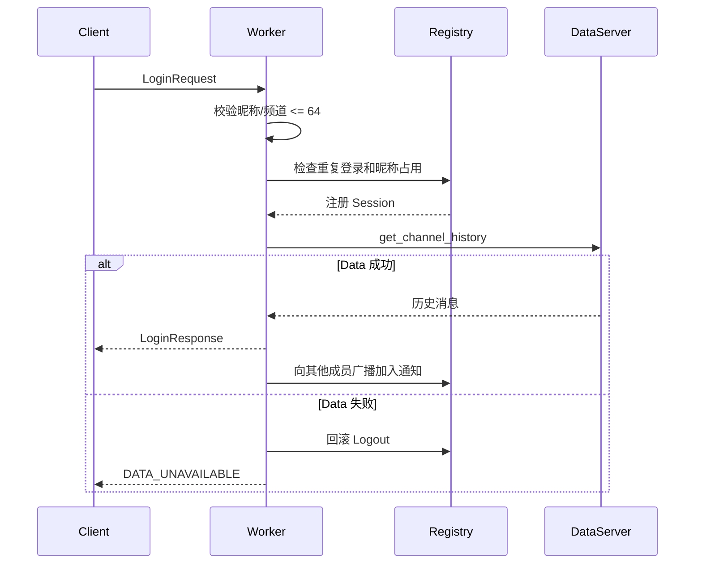
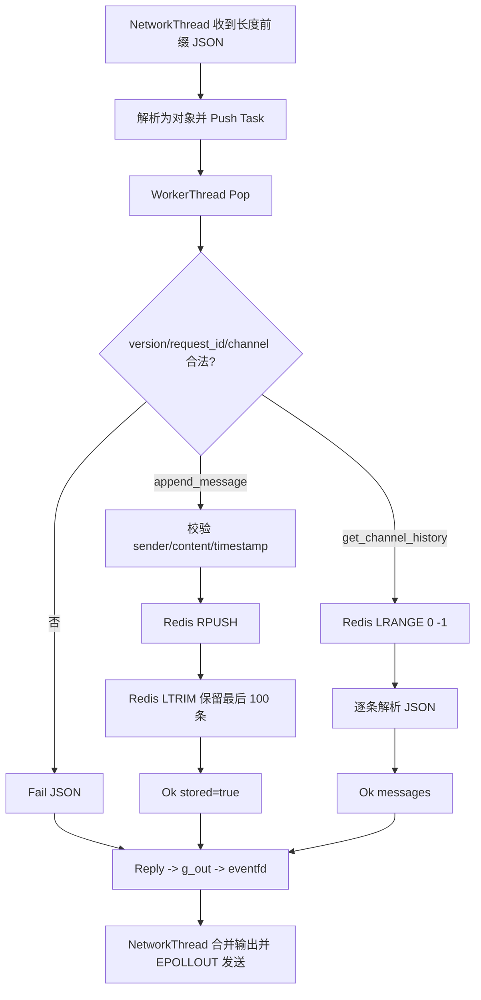
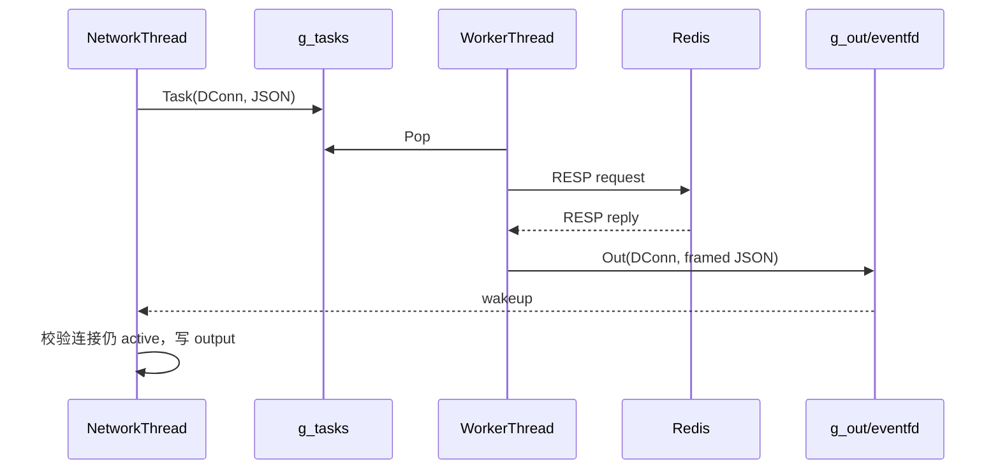
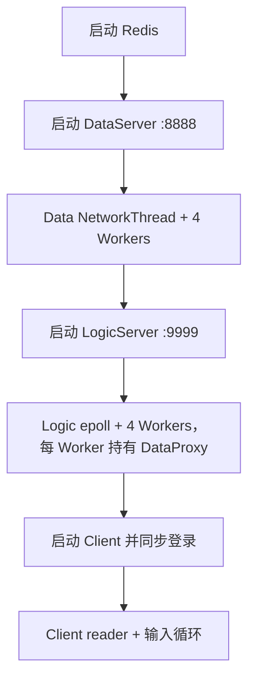
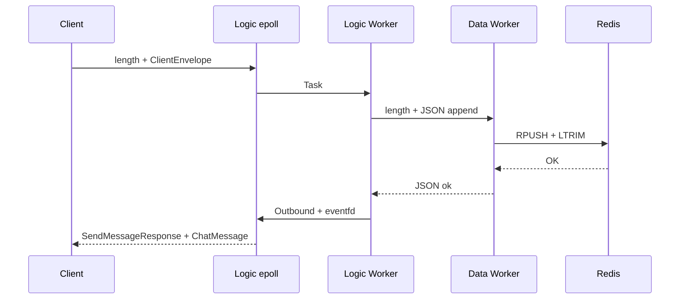
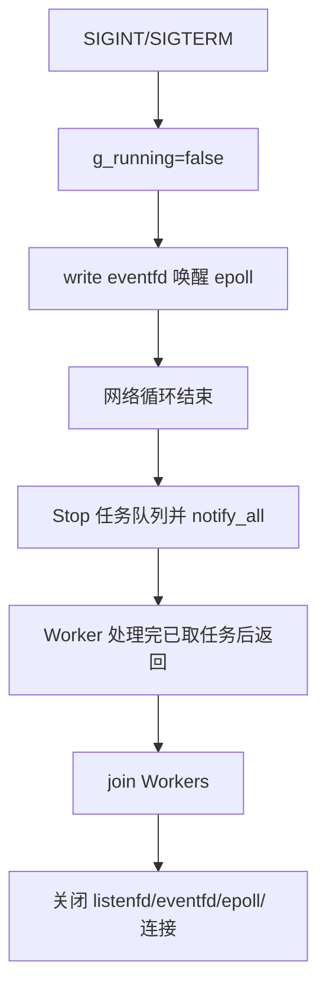

> 归档：以下内容描述重构前的单文件版本，不代表当前实现。当前文档见 [文档导航](../README.md)。

# TCP 游戏聊天室：按“先骨架、后业务”复盘全部程序

> 本文按照“职责 → 数据结构 → 全局状态与所有权 → 线程框架 → 生命周期 → 函数骨架 → 业务与异常”的顺序，逐个拆解 `protocol.proto`、`client.cpp`、`logicserver.cpp` 和 `dataserver.cpp`。内容描述当前仓库实现，不把设计目标和已实现功能混为一谈。

## 1. 为什么这个项目应该先写结构

聊天系统同时包含 TCP 字节流、异步事件、工作线程、在线会话、频道索引和 Redis 历史。如果先写 `recv` 和业务分支，很容易出现消息边界、连接复用、跨线程发送和资源退出互相缠绕。


## 2. 整体所有权



| 数据 | 所有者 | 说明 |
| --- | --- | --- |
| 用户输入和显示话 | Client | Client 生成 request_id 并展示响应 |
| TCP 输入/输出缓冲 | 各服务网络线程中的 `Connection/Conn` | 每个连接独立缓存半包和部分发送 |
| 在线昵称、频道成员 | LogicServer `Registry` | 互斥锁保护，Redis 不保存在线 socket |
| 业务任务 | `g_tasks` | 网络线程生产，4 个工作线程消费 |
| 待发送帧 | `g_outbound` / `g_out` | 工作线程生产，eventfd 唤醒网络线程发送 |
| 频道历史 | Redis | DataServer 用 `RPUSH + LTRIM` 保留最近 100 条 |

---

# 一、协议（`protocol.proto`）

## 1. 先把输入输出类型写清楚

客户端请求由 `ClientEnvelope` 包装：

| payload | 字段 | 用途 |
| --- | --- | --- |
| `LoginRequest` | nickname、channel_id | 登录并选择频道 |
| `SendMessageRequest` | content | 发送频道消息 |
| `QuitRequest` | 无 | 主动退出 |

服务端响应由 `ServerEnvelope` 包装：

| payload | 用途 |
| --- | --- |
| `LoginResponse` | 登录结果及 repeated 历史消息 |
| `SendMessageResponse` | 消息是否已保存 |
| `QuitResponse` | 退出确认 |
| `ChatMessage` | 服务端主动推送的聊天消息 |
| `SystemMessage` | 加入、离开等系统通知 |
| `ErrorResponse` | 机器可读 code + 人类可读 message |

`oneof` 保证一个 Envelope 在语义上只携带一种 payload。`request_id` 用来关联请求和响应；主动广播可以不依赖某个请求。字段编号一旦发布不应随意复用，删除字段时应考虑 `reserved`。

## 2. TCP 帧

```text
[uint32 network-order length][serialized protobuf bytes]
```

最大帧为 1 MiB。网络线程必须先等待 4 字节头，再等待完整消息体；输入缓冲中可能一次包含多帧，也可能只有半帧。

## 3. 内部 Data 协议

LogicServer 与 DataServer 使用同样的长度前缀，但消息体为 JSON：

```json
{
  "version": 1,
  "request_id": "...",
  "action": "append_message",
  "channel_id": "room-a",
  "sender_id": "alice",
  "content": "hello",
  "timestamp_ms": 0
}
```

成功响应包含 `ok=true` 和 `data`，失败响应包含 `ok=false` 以及 error code/message。

---

# 二、Client（`client.cpp`）

## 1. 数据和全局状态

| 状态 | 类型 | 作用 |
| --- | --- | --- |
| `kMaxFrame` | 常量 | 限制 Protobuf 帧最大 1 MiB |
| `g_running` | `atomic<bool>` | 协调主线程和接收线程停止 |
| `g_print` | `mutex` | 避免异步消息输出与其他输出交错 |
| `fd` | main 局部变量，被 reader 捕获 | 到 LogicServer 的唯一连接 |

## 2. 线程框架

| 线程 | 职责 | 阻塞点 | 退出条件 |
| --- | --- | --- | --- |
| 主线程 | 登录、读取标准输入、发送聊天/退出请求 | `getline`、阻塞发送 | `/quit`、EOF、发送失败、running=false |
| reader 线程 | 持续 `ReadProto` 并调用 `Print` | 阻塞 recv | 连接断开或 running=false |

## 3. 主流程



## 4. 函数骨架

- `SendAll` / `ReadAll`：处理部分发送、部分接收和 `EINTR`；
- `SendProto` / `ReadProto`：长度前缀与 Protobuf 序列化；
- `RequestId`：时间相关值加原子递增序号；
- `TimeText`：把毫秒时间戳格式化为本地时间；
- `Print`：按 ServerEnvelope payload 展示。

## 5. 当前边界

- 当前地址、端口、昵称和频道通过代码常量/交互输入确定，没有实现原设计文档里的配置文件和启动参数；
- 当前协议没有 PING/PONG，客户端未实现定时心跳；
- `ReadProto` 是阻塞读取，退出依靠 shutdown 让 reader 返回；
- 登录失败的早期返回路径还可以统一 close fd 和关闭 Protobuf 库。

---

# 三、LogicServer（`logicserver.cpp`）

## 1. 先定义核心结构

| 结构/类 | 字段或职责 | 为什么需要 |
| --- | --- | --- |
| `Queue<T>` | queue、mutex、cond、stopped | 网络线程与工作线程解耦 |
| `Session` | fd、递增 id、active | 用 shared_ptr 和 id 识别连接生命周期 |
| `Connection` | Session、input、output | 每连接半包与部分发送缓冲 |
| `Task` | Session + ClientEnvelope | 业务工作项拥有请求和会话 |
| `Outbound` | Session + 已编码帧 | 工作线程不能直接修改 epoll 连接输出 |
| `Registry` | users、channels、mutex | 管理昵称唯一性和频道成员 |
| `DataProxy` | 每工作线程一个 DataServer fd | 同步请求历史或追加消息，并在断线时重连 |

`Session` 由 shared_ptr 在网络线程、任务队列和输出队列间共享。fd 被复用时，还会比较 `Connection.session == Outbound.session`，避免旧任务写到新连接。

## 2. 全局状态

| 状态 | 生产者/修改者 | 消费者 |
| --- | --- | --- |
| `g_running` | 信号处理流程 | 主 epoll 循环 |
| `g_epoll` | main 初始化 | `SetEvents` 和 main |
| `g_wakeup` | main 初始化，工作线程写 | main 读 |
| `g_tasks` | main 网络线程 Push | 4 个 Worker Pop |
| `g_outbound` | Worker/业务 Push | main 在 eventfd 事件中 TryPop |
| `g_registry` | Worker 通过加锁修改 | Worker 查询/广播 |
| `conns` | main 局部、仅 epoll 线程拥有 | 不跨线程直接访问 |

## 3. 线程框架

| 线程 | 数量 | 职责 |
| --- | ---: | --- |
| main/epoll 线程 | 1 | accept、非阻塞 recv、拆 Protobuf 帧、输出缓冲发送、连接清理 |
| Worker | 4 | `Handle` 登录/聊天/退出，通过 DataProxy 阻塞访问 DataServer |

每个 Worker 在栈上创建一个 `DataProxy`，因此最多形成 4 条到 DataServer 的连接，避免多个 Worker 并发使用同一个 socket。

## 4. 网络线程流程



## 5. 业务流程

### 登录



### 发送消息

1. `Registry.InfoFor` 确认已登录；
2. 校验内容非空且不超过 8192 字节；
3. 构造带频道、发送者和时间戳的 `ChatMessage`；
4. `DataProxy.Append` 成功后回复“消息已保存”；
5. 取得频道成员快照并把 ChatMessage 放入每个成员的 Outbound。

### 退出/断线

主动 `QuitRequest` 会返回 QuitResponse、Registry Logout 并广播离开；网络断线则在 epoll 线程设置 `active=false`、Logout、关闭 fd 并删除 Connection。

## 6. eventfd 的作用

工作线程生成响应后不能直接安全地修改 main 线程的 `conns` 和 epoll 关注事件，因此先 Push `g_outbound`，再向 `g_wakeup` 写 8 字节计数。epoll 线程被唤醒后统一合并输出并开启 `EPOLLOUT`。

## 7. 当前边界

- `Queue<T>` 当前无容量上限，慢 DataServer 或慢客户端可能导致任务/输出积压；
- DataProxy 的 DataServer 访问在 Worker 中阻塞，隔离了 epoll 线程，但仍会占满 4 个 Worker；
- DataProxy 每次请求最多尝试两次，但 append 重试缺少严格幂等键，连接断在响应前时可能不确定是否已写入；
- 退出时调用了 `g_tasks.Stop()`，但还可以进一步停止/排空 `g_outbound` 并统一关闭所有客户端；
- 当前没有心跳、空闲会话清理、配置文件和运行指标。

---

# 四、DataServer（`dataserver.cpp`）

## 1. 核心结构和所有权

| 结构/类 | 内容 |
| --- | --- |
| `RedisProxy` | RESP 编码/解析、连接、重试、RPUSH/LTRIM/LRANGE |
| `Queue<T>` | 任务和输出生产者—消费者队列 |
| `DConn` | fd、递增 id、active |
| `Conn` | DConn shared_ptr、输入/输出缓冲 |
| `Task` | DConn + JSON 请求 |
| `Out` | DConn + 已编码 JSON 帧 |

`conns` 只在 NetworkThread 中访问；WorkerThread 只持有 shared_ptr<DConn>，通过 `g_out` 返回结果。每个 WorkerThread 拥有独立 `RedisProxy`，因此最多 4 条 Redis TCP 连接。

## 2. 全局状态与线程

| 状态 | 作用 |
| --- | --- |
| `g_running` | 信号触发停止 NetworkThread |
| `g_epoll`、`g_wakeup` | DataServer 事件循环和跨线程唤醒 |
| `g_tasks` | NetworkThread → 4 个 WorkerThread |
| `g_out` | WorkerThread → NetworkThread |

主函数先启动一个 `NetworkThread`，再启动 4 个 `WorkerThread`；网络线程 join 后停止任务队列并 join 所有 Worker。

## 3. Data 请求流程



## 4. Redis RESP 处理

`RedisProxy.ExecOnce` 把每个命令编码为 RESP 数组；`Reply` 支持简单字符串、整数、错误、Bulk String 和数组，并限制长度和数组数量。`Exec` 在连接失败时关闭旧 fd，重新连接并最多尝试两次。

Redis Key 为：

```text
chat:channel:<channel_id>:messages
```

Append 通过 `RPUSH` 加入 JSON 消息，再用 `LTRIM key -100 -1` 保留最近 100 条；List 通过 `LRANGE key 0 -1` 返回全部保留记录。

## 5. 网络线程流程

DataServer 的 NetworkThread 与 LogicServer main 使用相同骨架：非阻塞监听、每连接输入/输出缓冲、长度前缀拆包、任务队列、eventfd 回传、按需启用 `EPOLLOUT`，并用 `DConn` shared_ptr 检查旧结果是否仍属于当前连接。



## 6. 当前边界

- `g_tasks` 和 `g_out` 没有容量上限和积压指标；
- `RPUSH` 与 `LTRIM` 是两条独立命令，若中间失败可能暂时超过 100 条，可考虑事务/Lua；
- 重试 append 不是严格幂等，request_id 尚未作为 Redis 去重键；
- Redis 是单点，当前没有认证、TLS、连接超时和高可用切换；
- Redis 中出现一条损坏 JSON 时，整次历史查询返回 `CORRUPT_DATA`；可设计跳过并记录坏记录；
- 服务退出时可以补充关闭所有活动连接、停止输出队列和排空剩余任务。

---

# 五、整个项目的启动、运行和退出

## 1. 启动顺序



LogicServer 不在启动时强制连接 DataServer，而是每个 Worker 的 DataProxy 在第一次历史/追加请求时懒连接。DataServer 的 Worker 也在第一次 Redis 操作时懒连接 Redis。

## 2. 完整消息链路



## 3. 退出框架



当前实现已经具备基本停止框架，但还可以继续补齐输出队列排空和全部客户端连接的显式关闭。

# 六、以后新增功能时怎么继续用这套方法

例如加入私聊、心跳或多频道切换，先完成以下设计表：

| 步骤 | TCP 聊天项目中的问题 |
| --- | --- |
| 数据结构 | Protobuf 增加什么消息？Session/Registry 增加什么状态？ |
| 所有权 | 在线状态在 Logic，历史状态在 Redis，是否仍成立？ |
| 全局状态 | 是否需要新队列、索引、计时器或统计量？由谁保护？ |
| 线程框架 | 新操作会不会阻塞 epoll？放在哪个 Worker？ |
| 协议 | request_id、错误码、版本和最大长度如何定义？ |
| 流程 | 登录前能否调用？断线中途怎样取消？Data 失败是否回滚？ |
| 退出 | 队列中剩余任务、定时器和连接如何停止？ |
| 验证 | 半包、重复请求、昵称冲突、Redis 断线和慢客户端如何测试？ |

## 总结

这个项目的骨架顺序非常清晰：先用 Protobuf 定义外部数据，再用 Session/Connection/Task/Outbound 表达生命周期和线程间传递，用 Queue、epoll 与 eventfd 固定并发框架，最后实现登录、发送、退出和 Redis 历史。继续改进时，应优先补队列容量、幂等、心跳、配置、退出排空和自动化测试，而不是把更多业务直接塞进事件循环。

